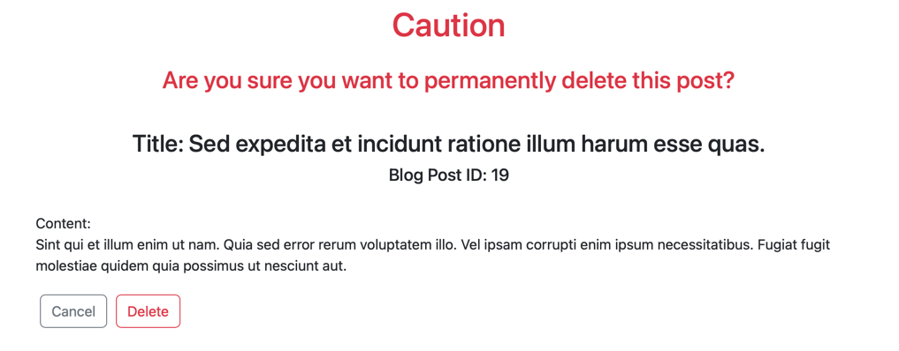

# COSC360 A1 - Basic Blog

### GitHub Repository: https://github.com/AndyMac124/A1_Basic_Blog.git

#### Author: Andrew McKenzie
#### Email: amcken33@myune.edu.au  
#### Student ID: 220263507

---

### Configuring and running from ZIP file
1. Unzip the provided folder and open in an editor of your choice.
2. Configure and add the .env file, there is an example in .env.example.
3. Set up the database connection in the .env file.
4. Run `npm install`.
5. Run `composer install`.
6. I also recommend running `php artisan migrate` to confirm the migration.
7. Start your database and server of choice.
8. Run `npm run dev`.
9. Run `php artisan serve`.

*Note: Under the database directory you will find the PostFactory factory and PostSeeder seeder if needed.*

---

## Report

### Approach:
My approach was to step through the lectures again while considering what is best
specifically for a blog. In such I modified the 'welcome' page the comes default with Laravel
to be a single button to enter the site. From there, I used the bootstrap documentation to modify 
elements to be what I believe is more user-friendly and coloured the buttons as I felt appropriate.
I created an intermediary between selecting delete on a post and actually destroying the post. Since this is an
irreversible action it feels important to confirm their decision and I decided a separate view with
red font and the full blog they are deleting was best.

```html
    <!-- Example of customisation of the UI -->
    <h1 class="text-danger">Caution</h1>
    <h3 class="text-danger">Are you sure you want to permanently delete this post?</h3>
```

```php
    public function confirmDelete(Post $post) {
        return view('posts.delete', compact('post'));
    }
```

### Challenges Faced:
The first challenge was getting my head around Laravel, I have never dealt with MVC architecture before
and the overall project structure of a Laravel project is very different to past websites I have worked on.
Research solved this and I now find Laravel projects to have a very clean project structure and seem very scalable,
so I am very glad we have been introduced to this framework.

The next challenge for me was that I had never used bootstrap, only plain CSS and Tailwind CSS. I found this to be 
a very quick and pleasing challenge to overcome, the documentation was very clear and visual, options were easy to use
and overall much simpler to learn than Tailwind and definitely a good option for simple websites.

```html
<!-- Bootstrap examples -->
<button type="submit" class="btn btn-outline-primary">Submit</button>

<h3 class="fw-medium"><br>Title: {{ $post->title }}</h3>
```

### Bonus Marks:
For the bonus mark, I have added an additional view `'delete.blade.php'` you are routed here when you 
select the delete button on a post, hence the choice 'delete' for the name.
It serves the purpose of being a confirmation page for the delete/destroy function.
This involved creating a new view with the full post and a confirmation message, then altering the routes
to send the delete button here before calling the destroy function.


